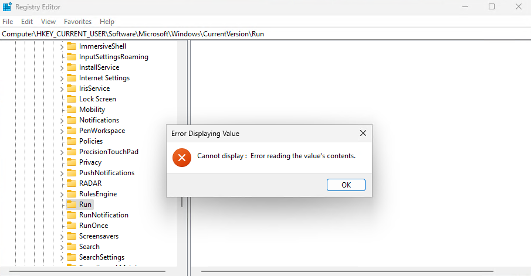
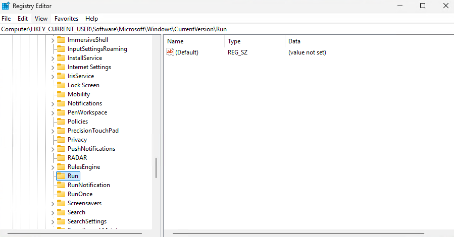

# Registry_Masquerade-Delphi

This application masquerade registry value, using null embedded character. 
This can be used for Persistence.

# Usage

```bat
Registry Masquerade Usage:
  -enable -command "<command_path>" : Enable startup entry
  -disable                          : Disable startup entry
  -status                           : Show current status
  -help                             : Show this help message

Examples:
  drm.exe -enable -command "C:\Windows\System32\notepad.exe"
  drm.exe -disable
  drm.exe -status
```

For example we want the notepad to be run automatically when a user logs into the system.

```bat
drm.exe -enable -command "C:\Windows\System32\notepad.exe"

Setting registry value with null char...
Registry path: \Registry\User\S-1-5-21-4127810242-1992510350-945644731-1001\Software\Microsoft\Windows\CurrentVersion\Run
NtCreateKey Status: 0
Key created/opened successfully
Registry value set successfully with command: C:\Windows\System32\notepad.exe
```
The name of the registry value starts with a NULL character, followed by the actual name. Since WinAPI uses null terminated strings, the name of the value technically equals to NULL.

 However, the notepad is still executed on startup because the content of the value is valid. The registry editor is unable to display this value, and so is any program that uses the WinAPI to read the registry. It is required to use the native API, which uses UNICODE_STRING allowing to read and write embedded NULL characters.

 Done! Persistence is now achieved.





To remove the entry use the disable flag.

```bat
drm.exe -disable -command "C:\Windows\System32\notepad.exe"

Registry value removed successfully
```
<br>

<p align="center">Made with ❤️ using Delphi RAD Studio</p>


